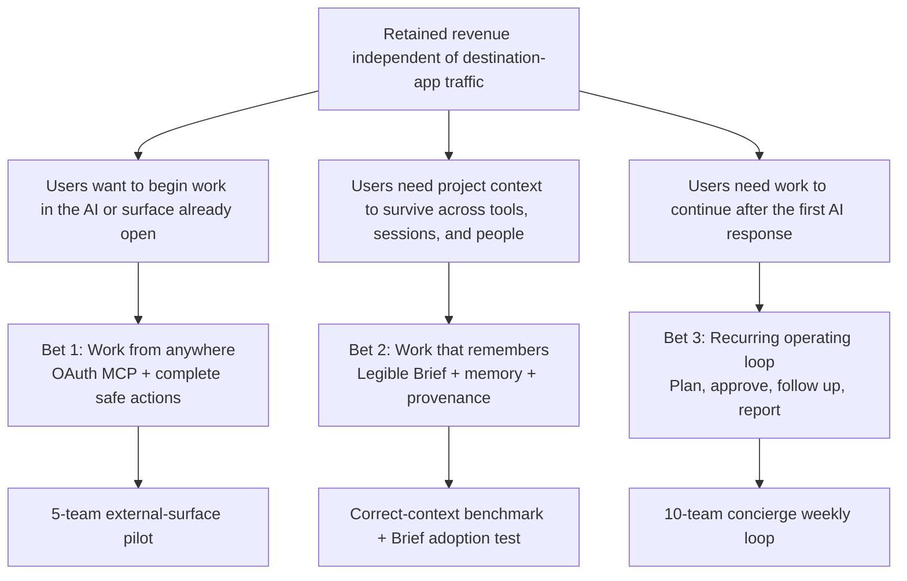

# DragonFruit — AI-Native Story and Business Proposal

> **Status:** Proposed strategic direction  
> **Date:** 2026-07-30  
> **Decision owner:** Founder  
> **Canonical copy:** `DRAGONFRUIT_SOURCE_OF_TRUTH.md` §1.8  
> **Implementation:** `plans/ai-native/031-work-from-anywhere.md`, `plans/ai-native/032-work-that-remembers.md`, `plans/ai-native/033-recurring-operating-loop.md`

## Executive decision

DragonFruit should be described differently inside the company and outside it.

- **Internal strategy / partner language:** the trusted, AI-native system of record and control plane for work.
- **Customer language:** **a quiet place where your work keeps its context.**

“Control plane” explains the defensible business model, but it is too technical and cold for the homepage. “Quiet place” describes the emotional benefit. “Keeps its context” explains the functional advantage. Together they make the product more than another task manager with a chatbot.

The recommended homepage evolution is:

> **A quiet place where ideas become work.**
>
> DragonFruit keeps your ideas, docs, tasks, and project context together. Atlas helps move the work forward—and asks before anything important changes.

The cross-interface promise sits underneath:

> **Start anywhere. Your context stays here.**

Users may begin in DragonFruit, ChatGPT, Claude, Codex, a browser extension, the Mac app, or an inbound integration. DragonFruit remains the durable home where the work, decisions, permissions, and history live.

## Annotation 1 — what the control-plane statement means

> “The trusted control plane where work is stored, understood, approved, and executed—regardless of which AI interface starts it.”

This is the business architecture behind the public story:

| Internal meaning                | Customer translation                               |
| ------------------------------- | -------------------------------------------------- |
| System of record                | Your work stays together                           |
| Context and memory layer        | You do not have to explain the project again       |
| Permission and approval engine  | Nothing important changes without your yes         |
| Workflow execution layer        | Work keeps moving after the first draft            |
| Multi-surface API/MCP platform  | Start wherever you already work                    |
| Open-source and BYOK deployment | Your data, keys, and costs stay under your control |

The product should not try to prevent general AI interfaces from replacing some DragonFruit page visits. It should make those interfaces more useful by giving them safe access to DragonFruit’s context and actions.

## Desired business outcome

Within 90 days of the first design-partner cohort:

- at least 10 workspaces complete the core weekly operating loop;
- at least 60% remain active at week 4;
- retained workspaces complete at least 3 successful delegated workflows per week;
- at least 30% of those workflows begin outside the main DragonFruit web app;
- at least 5 workspaces demonstrate willingness to pay.

The North Star is:

> **Successful delegated workflows completed per active workspace per week.**

A successful delegated workflow begins with an idea, request, event, or source; produces a useful change or deliverable; passes any required approval; and reaches a completed state. Pageviews, messages, and model calls are supporting telemetry, not proof of value.

## Opportunity solution tree

## Positioning

### Category

**The calm home for work that remembers.**

This category avoids three weak frames:

- “AI project management,” which sounds like a feature bundle;
- “agent platform,” which makes the machinery the product;
- “Notion/Plane with AI,” which anchors DragonFruit as a derivative destination app.

### Competitive alternatives

DragonFruit competes with the behavior users assemble today:

- tasks in one app;
- docs in another;
- project context in somebody’s head;
- ChatGPT or Claude in a separate tab;
- repeated prompts and manual copy/paste;
- follow-ups dependent on human memory.

The competitor is not only another workspace. It is **context resetting every time work moves**.

### Differentiated value

1. **Calm home:** ideas, Docs, Tasks, Sheets, decisions, and history stay together.
2. **Work that remembers:** the Workspace Brief and Project Brief give people and AI shared, correctable context.
3. **Trusted action:** Atlas drafts and acts through explicit permissions and approvals.
4. **Start anywhere:** DragonFruit can be used from external AI clients and integrations, not only its own UI.
5. **Ownership:** AGPL, self-hosting, export, and BYOK reduce platform and vendor risk.

### Primary customer

The initial revenue audience remains AI-forward startups and small teams with 2–50 people. The champion is a founder, operator, or tools-owning engineer who feels the cost of context scattered across tasks, docs, meetings, and AI chats.

The other audiences remain useful, but should not determine the initial product:

- one-person studios provide distribution and fast feedback;
- self-hosters provide trust, technical proof, and advocacy.

## Narrative system

### The hero

A builder or small team with more ideas than coordination capacity. They do not need more software to maintain. They need a dependable place that keeps the work coherent.

### The villain

**Context decay:** every move between a thought, chat, meeting, Doc, and Task drops meaning. AI can create another answer, but it cannot reliably remember what the team decided or follow the work to completion.

### The guide

DragonFruit provides the quiet home. Atlas helps inside it. The user remains the decision-maker.

### The three-step story

1. **Start anywhere** — bring an idea, meeting, note, prompt, or existing project.
2. **Keep the context** — DragonFruit connects the idea to the relevant Docs, Tasks, decisions, and Brief.
3. **Move it forward** — Atlas drafts, follows up, and executes within the permissions the user approves.

### The transformation

From:

> “My work is scattered, and every AI starts from zero.”

To:

> “My work has a home. It remembers what matters and keeps moving.”

## Copy architecture

### Recommended homepage system

**Eyebrow**

> START ANYWHERE. YOUR CONTEXT STAYS HERE.

**H1**

> A quiet place where ideas become work.

**Subhead**

> DragonFruit keeps your ideas, Docs, Tasks, and project context together. Atlas helps move the work forward—and asks before anything important changes.

**Primary CTA**

> Start free

**Secondary CTA**

> Watch the weekly loop

**Trust line**

> Open-source. Self-hostable. Bring your own AI key.

### Supporting section headlines

| Story beat | Headline                                                        | Supporting idea                                                                   |
| ---------- | --------------------------------------------------------------- | --------------------------------------------------------------------------------- |
| Problem    | **Your work should not forget itself.**                         | Context disappears between chats, docs, meetings, and task lists.                 |
| Home       | **Everything the project knows, in one quiet place.**           | Ideas, Docs, Tasks, Sheets, decisions, and history stay connected.                |
| Memory     | **Explain it once. Keep it correct.**                           | Briefs make project context visible to people and Atlas.                          |
| Action     | **Atlas moves the work. You keep the judgment.**                | Drafts, follow-ups, and changes respect approval policies.                        |
| Anywhere   | **Use the AI you already use.**                                 | Start in DragonFruit or a connected AI surface; the work lands in the same place. |
| Ownership  | **Your context is not platform bait.**                          | Self-host, use your own model key, and export your data.                          |
| Outcome    | **From loose idea to finished work—without losing the thread.** | The recurring loop is the product demonstration.                                  |

### Short-form lines

- A quiet place where your work keeps its context.
- Start anywhere. Your work stays together.
- Your work, with its memory intact.
- Ideas become Docs. Docs become Tasks. Context stays attached.
- Atlas remembers the project—not just the prompt.
- The AI can change. Your work still has a home.
- Bring the mess. Keep the meaning. Move the work.

### Copy to avoid

- “AI control plane” on consumer-facing pages;
- “all your context” without explaining what that means;
- claims that Atlas autonomously runs the company;
- generic “AI-powered productivity” or “10x” language;
- implying users must abandon ChatGPT, Claude, or another preferred AI;
- describing memory as secret model knowledge the user cannot inspect.

## Website story map

1. **Hero:** quiet place + transformation + approval.
2. **Problem:** context decays as work moves between surfaces.
3. **Product home:** show a connected idea, Doc, Task, decision, and Brief.
4. **Weekly loop demo:** messy input → proposed plan → approval → follow-up → report.
5. **Memory:** show the user editing what DragonFruit/Atlas knows.
6. **Start anywhere:** show DragonFruit, ChatGPT/Claude/Codex, Mac, and browser surfaces feeding the same workspace.
7. **Trust:** approval policies, activity history, BYOK, self-hosting, export.
8. **Pricing:** pay for sustained shared context and recurring execution, not for another chat box.
9. **CTA:** bring one real project.

The main visual proof should be the weekly loop, not a static list of features.

## Business proposition

### What customers buy

Customers are not primarily buying model output. Model output is increasingly abundant. They are buying:

- continuity of context;
- a canonical record of decisions and work;
- reliable conversion from ideas into structured execution;
- safe permissions and human approval;
- recurring follow-through;
- the freedom to change models or interfaces without rebuilding the workspace.

### Packaging hypothesis to validate

Do not lock this into billing until tested.

| Offer         | Purpose            | Hypothesis                                                                           |
| ------------- | ------------------ | ------------------------------------------------------------------------------------ |
| Free Cloud    | Activation         | Solo workspace plus enough Atlas actions to experience the core loop                 |
| Pro workspace | Primary revenue    | Shared context, recurring workflows, approvals, integrations, and external AI access |
| Atlas Cloud   | Convenience/usage  | Managed model usage with visible metering and spend controls                         |
| Business      | Governance         | SSO, audit controls, policy administration, support, and SLA                         |
| Self-hosted   | Trust/distribution | Full open-source product with BYOK; paid support or managed deployment later         |

Pure per-seat pricing may be misaligned if Atlas helps a team do more with fewer people. Test a workspace base price with included seats and workflow capacity against the existing per-seat proposal.

### Go-to-market story

Every channel demonstrates the same outcome with a different entry point:

- **Founders/teams:** “The project remembers, even when work starts in ChatGPT.”
- **Creators:** “I dropped in a messy idea and came back to an approved plan.”
- **Self-hosters:** “Your workspace, context, model key, and history remain yours.”
- **Partners/investors:** “DragonFruit is the system of record and execution layer beneath interchangeable AI interfaces.”

### Content pillars

1. **Work that remembers:** show a Brief correcting Atlas and improving the next run.
2. **Start anywhere:** begin in an external AI and watch the work land safely in DragonFruit.
3. **The weekly loop:** show planning, approval, follow-through, and reporting.
4. **Visible trust:** show a blocked action, approval, attribution, and history.
5. **Model independence:** change model/provider without losing project memory or workflow state.

## Prioritized experiments

### 1. Concierge weekly loop

Recruit 10 Lean Builder teams. Run the loop manually where necessary for four weeks. Ask for payment by week two.

Success:

- 6/10 teams use the loop in at least three weeks;
- 5/10 agree to pay;
- users describe the value as continuity/follow-through, not merely good text generation.

### 2. External-surface pilot

Connect five teams through the existing token-based MCP endpoint before building full OAuth.

Success:

- setup can be completed with founder assistance in under 20 minutes;
- 4/5 teams initiate at least three useful actions per week outside DragonFruit;
- external usage increases DragonFruit workflow completion rather than replacing the workspace.

### 3. Memory legibility test

Give teams an editable Project Brief and show exactly when Atlas used it. Seed one incorrect fact and observe whether users can find and correct it.

Success:

- 80% can explain what Atlas knows and where it came from;
- 80% can correct the seeded fact without support;
- corrected context is used accurately on the next relevant run.

### 4. Packaging test

Compare “no Atlas on Free” with a small monthly allowance or time-bound core-loop trial.

Success:

- more users reach a first approved outcome;
- week-2 retention improves;
- paid intent does not materially decline.

## Deferred bets

- a general marketplace for user-created agents;
- building or training a proprietary foundation model;
- broad enterprise portfolio management;
- deep RAG over every file before Brief-based context is validated;
- complex autonomous workflows without approval and recovery;
- destination-app features that do not strengthen context, trust, or follow-through.

## Open questions

- Do customers perceive “quiet” as calm and focused, or passive and underpowered?
- Is “work that remembers” more compelling than “AI teammate” after a real product demo?
- Which external surface drives repeat behavior rather than novelty?
- Is the weekly loop frequent and painful enough to support workspace pricing?
- What context belongs in a Brief, durable memory, activity history, or source Doc?
- How much setup will teams tolerate before the first useful result?
- Should external AI access be a Pro feature, an activation feature, or both with different limits?

This strategy is built on evidenced repository capabilities but still-assumed customer needs. Validate it with real teams before committing to the complete build.

The solution bets chosen here define the scope of what needs to be designed. Next, define the conceptual model—the objects, relationships, states, and vocabulary those solutions will work with.
