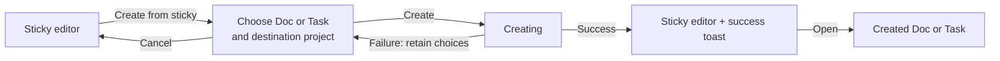

# Plan 028: Create a Doc or Task from a Sticky

> **Executor instructions**: Read this plan completely before editing. Follow
> the product contract and STOP conditions; do not turn this into a destructive
> conversion or invent a backend relationship. Run every verification command
> and update the status row in `plans/README.md` when complete.
>
> **Drift check (run first)**:
>
> ```bash
> git diff --stat 4183a9135a..HEAD -- \
>   apps/web/core/components/editor/sticky-editor \
>   apps/web/core/components/stickies \
>   apps/web/core/services/page apps/web/core/services/issue \
>   apps/web/package.json pnpm-workspace.yaml pnpm-lock.yaml
> git diff --stat -- \
>   apps/web/core/components/editor/sticky-editor \
>   apps/web/core/components/stickies \
>   apps/web/core/services/page apps/web/core/services/issue \
>   apps/web/package.json pnpm-workspace.yaml pnpm-lock.yaml
> ```
>
> The working tree was already heavily modified when this plan was written,
> including `apps/web/package.json`, `pnpm-workspace.yaml`, and `pnpm-lock.yaml`.
> Preserve those edits. If their dependency/script changes cannot be reconciled
> cleanly with the small Vitest addition in this plan, STOP and report the
> overlap instead of overwriting them.

## Status

- **Priority**: P2
- **Effort**: S–M (one focused web flow plus a small unit-test setup)
- **Risk**: LOW–MED (additive and non-destructive, but the Sticky editor has a
  debounced save path that must not drop the user's latest keystrokes)
- **Depends on**: existing Sticky project scoping and existing Doc/Task create
  APIs
- **Category**: product / capture workflow
- **Planned at**: commit `4183a9135a`, 2026-07-20

## Why this matters

Stickies are the fastest capture surface in DragonFruit, but an idea that
becomes real work currently has to be copied manually into a Doc or Task.
DragonFruit already has all three objects and already lets a Doc embed a
Sticky. The missing job is different: **promote the captured content into a
durable working object without retyping it or losing the original note**.

The narrow V1 is intentionally a copy operation. It creates a Doc or Task from
the Sticky's visible content and leaves the Sticky untouched. This is safer
than deleting or archiving the source and avoids pretending there is a durable
relationship when the product does not yet model one.

## Product contract (do not change without product approval)

### Vocabulary and semantics

- The product noun is **Sticky** (not “Stickie”).
- The toolbar action is **Create from sticky**. The dialog title is **Create
  from sticky**, with target choices **Doc** and **Task**.
- Do not label the action “Convert” or “Move.” Those verbs imply that the
  source disappears or changes identity.
- Creating a target copies content at that moment. The original Sticky remains
  editable and in the same workspace/project scope.
- V1 does not store provenance, a backlink, a conversion flag, or a durable
  Sticky → target relationship. Repeating the action may create another target.

### Content mapping

Resolve one normalized title before calling either API:

1. trimmed `sticky.name`, when non-empty;
2. otherwise the first 100 characters of the normalized plain text from
   `sticky.description_html`;
3. otherwise `Untitled sticky`.

Collapse whitespace in the derived plain-text fallback. Do not render raw HTML
in the title. The Sticky title is already limited to 100 characters, so use the
same 100-character cap for the derived fallback.

| Sticky source        | New Doc                                       | New Task                 |
| -------------------- | --------------------------------------------- | ------------------------ |
| resolved title       | `name`                                        | `name`                   |
| `description_html`   | `description_html`                            | `description_html`       |
| —                    | `page_type: "doc"`                           | project defaults         |
| —                    | private access (`EPageAccess.PRIVATE`)        | project default state    |
| color, tags, ordering | deliberately not copied                      | deliberately not copied  |

Preserve the rich-text HTML exactly as the existing Sticky API returned it.
Do not convert it through Markdown or plain text. Use `<p></p>` only when the
body is absent.

### Destination project

- Both current creation APIs require a project, so the dialog always exposes a
  single project picker.
- Preselect `sticky.project` when it is still an active joined project in the
  current workspace.
- Otherwise preselect the current route's project when eligible.
- Otherwise leave the field empty and require a choice.
- Only show active projects where the current user can create content (Admin or
  Member). Guests and archived projects must not appear as valid destinations.
- A project-scoped Sticky is not permanently bound to that project; the user may
  choose another eligible destination.

### Completion, errors, and navigation

- Disable submit until the target type and an eligible project are selected.
- While creating, lock target/project controls and show one in-progress state;
  double submission must be impossible.
- On success, close the dialog and show a success toast:
  - `Doc created from sticky` or `Task created from sticky`;
  - include an **Open doc** / **Open task** action that navigates in the current
    tab.
- Do not navigate automatically. The user may want to continue processing
  Stickies.
- On API failure, keep the dialog open, retain both selections, show an inline
  recoverable error, and re-enable submit.
- Cancel closes the dialog without creating or changing anything.

### Explicitly out of V1

- Deleting, archiving, hiding, or marking the source Sticky as converted.
- Sticky ↔ Doc/Task backlinks, conversion history, deduplication, or undoing a
  created target.
- Creating a Doc inside a selected folder.
- Copying Sticky color or tags into Doc tags, Task labels, priority, assignees,
  dates, or state.
- Editing the copied title/body inside the dialog. The Sticky itself is the
  editor; the dialog only chooses target and destination.
- Mobile, Copilot, Atlas tools, public/Space surfaces, and Doc-embed behavior.
- Backend models, migrations, or new endpoints.
- Bulk creation from multiple Stickies.

## Conceptual model

No new persistent object is introduced in V1.

```text
Sticky (private capture owned by one user)
  └─ Create from sticky (one-time copy operation)
       ├─ creates Doc in one Project
       └─ creates Task in one Project
```

The operation reads a snapshot of the Sticky and creates a separate target.
After success, the two objects have independent lifecycles: editing or deleting
either one does not affect the other.

This is a deliberate model boundary. If product later needs “show everything
created from this Sticky,” that requires a real Promotion/Source relationship
and a separate plan; do not infer it from matching content.

## Job story and interaction flow

**Job story**: When a quick note becomes substantial work, I want to create a
Doc or Task from it so I can continue in the right workflow without copying the
content or risking the original capture.

### Breadboard

```text
Sticky editor
- Create from sticky → Create-from-Sticky dialog
[current title/body, formatting toolbar, color, delete]

Create-from-Sticky dialog
- choose Doc or Task → same dialog, selected-target state
- choose eligible project → same dialog, selected-project state
- Create doc/task → Creating state
- Cancel → Sticky editor
[target choices, project picker, source title preview, explanation that the Sticky stays]

Creating state
- success → Sticky editor + success toast
- failure → Create-from-Sticky dialog with inline error
[locked controls, progress indicator]

Success toast
- Open doc/task → created target
- dismiss/timeout → remain in Sticky editor
[created target type and title]
```



## Current state

### Sticky model and API

- `apps/api/plane/db/models/sticky.py` defines a first-class Sticky with title,
  rich-text body fields, color, tags, owner, workspace, optional `project`, and
  sort order.
- `apps/api/plane/app/views/workspace/sticky.py` scopes every read and mutation
  to `owner_id=request.user.id`. Stickies are personal even when their project
  is shared.
- The same view's list behavior separates workspace-level Stickies from
  project-scoped Stickies through `project_id`.
- No Sticky contract or database field currently points to a Page or Issue.

### Existing Doc embedding is not this feature

- `apps/web/ce/hooks/use-doc-embed.tsx` and
  `apps/web/core/components/editor/embeds/doc-embed/picker.tsx` already let a Doc
  embed a Sticky card.
- That embed is a live reference and remains inside a Doc. This plan instead
  creates an independent Doc or Task from the Sticky's contents.
- Do not change the embed node, picker, or `DocEmbedCard` while implementing
  this plan.

### Sticky UI

- `apps/web/core/components/editor/sticky-editor/toolbar.tsx` currently owns
  formatting, color, and delete actions. It is the natural home for one
  additional **Create from sticky** action.
- `apps/web/core/components/stickies/sticky/inputs.tsx` owns the live
  `react-hook-form` title/body values.
- `apps/web/core/components/stickies/sticky/root.tsx` owns the 500 ms debounced
  save and can flush it before opening the create dialog.
- `apps/web/core/components/stickies/sticky/use-operations.tsx` already handles
  Sticky CRUD. Target creation should not be added to that CRUD abstraction;
  keep the new operation in its focused component/helper.

### Existing target creation

- `ProjectPageService.create(workspaceSlug, projectId, data)` already creates a
  project Page and accepts `name`, `page_type`, `access`, and
  `description_html`.
- `IssueService.createIssue(workspaceSlug, projectId, data)` already creates a
  Task and accepts `name` and `description_html`.
- Reusing these endpoints preserves the normal backend permissions, default
  Task state/assignee behavior, Page setup, activity creation, and response
  shapes. Do not duplicate those backend paths in a Sticky endpoint.
- `ProjectDropdown` uses `joinedProjectIds`; add an Admin/Member render filter
  because joined projects also include guests.
- `@plane/propel/toast` supports `actionItems`, which is the established way to
  offer **Open** without forced navigation.

### Test infrastructure gap

- `apps/web` currently has type, lint, format, and build scripts but no unit
  test script.
- Vitest already exists elsewhere in the workspace. Add the smallest Node-only
  Vitest setup needed to test the pure payload/title helper; do not add React
  Testing Library or a browser test stack for this feature.

## Target component flow

```text
StickyInput (owns freshest form values)
        │ snapshot {name, description_html}
        ▼
StickyNote root
  ├─ flush pending debounced Sticky save
  └─ open CreateFromStickyModal with the snapshot
        │
        ├─ ProjectPageService.create(...)  → Doc result + URL
        └─ IssueService.createIssue(...)   → Task result + URL
                                            │
                                            ▼
                              success toast with Open action
```

The dialog must use the form snapshot passed at click time, not re-read the
MobX store after opening. The store may trail the editor by 500 ms.

## Implementation steps

### 1. Add a pure, tested payload mapper

Create
`apps/web/core/components/stickies/create-from-sticky/helpers.ts` with:

- a target union: `"doc" | "task"`;
- `resolveStickyTargetTitle(...)` implementing the exact fallback and
  whitespace/truncation rules above;
- `buildStickyTargetPayload(target, snapshot)` returning a discriminated
  Doc/Task payload while preserving `description_html`;
- no React, MobX, router, or network imports.

Create `helpers.test.ts` beside it. Cover at least:

1. trimmed Sticky title wins;
2. blank title falls back to normalized body text;
3. HTML tags never appear in the derived title;
4. fallback title is capped at 100 characters;
5. empty content becomes `Untitled sticky`;
6. rich-text body HTML is preserved byte-for-byte;
7. Doc payload is private and has `page_type: "doc"`;
8. Task payload does not invent state, label, priority, or assignee fields.

Add a `test:unit` script and a `vitest` dev dependency to `apps/web`. Because
external dependencies use the workspace catalog, add the chosen Vitest version
to `pnpm-workspace.yaml` and reference it as `catalog:`. Regenerate
`pnpm-lock.yaml` with pnpm; do not hand-edit the lockfile.

No Vitest config file should be necessary for a Node-only relative-import test.
If one is required, keep it local to `apps/web` and do not alter the React Router
build config.

### 2. Build the focused creation dialog

Create:

- `apps/web/core/components/stickies/create-from-sticky/modal.tsx`
- `apps/web/core/components/stickies/create-from-sticky/index.ts`

The modal receives:

- `isOpen`, `onClose`;
- `workspaceSlug`;
- the persisted Sticky ID (for identity/display only);
- the click-time `{ name, description_html }` snapshot;
- optional `sticky.project` as the preferred project.

Behavior:

1. Reset target, project, error, and submitting state on each closed → open
   transition.
2. Default target to neither option; make the user choose Doc or Task so the
   action is explicit.
3. Choose the default project using the precedence rules in the product
   contract, but only when eligible.
4. Render the existing `ProjectDropdown` in single-select mode and filter it to
   Admin/Member active projects.
5. Show the resolved target title as a one-line preview plus the sentence
   `Your sticky will stay here.`
6. Submit through `ProjectPageService` or `IssueService`; do not write directly
   to MobX Page/Issue stores.
7. Derive the canonical navigation target from the returned object:
   - Doc: `/{workspaceSlug}/projects/{projectId}/pages/{page.id}`;
   - Task: use `generateWorkItemLink` with the selected project's identifier
     and returned `sequence_id`; retain the project/issue route as a fallback
     if identifier metadata is unexpectedly unavailable.
8. On success, close and emit the actionable toast. On failure, normalize the
   API error into a short inline message and retain the dialog state.

Use existing Modal, Button, project dropdown, and form primitives. Icons must
come from the Solar system through the local shims or `@solar-icons/react`.
Respect focus trapping, Escape/cancel, accessible labels, disabled states, and
reduced motion supplied by those primitives.

### 3. Wire the action to the freshest Sticky snapshot

Modify the prop chain:

```text
StickyEditorToolbar
  → StickyEditor
    → StickyInput
      → StickyNote root
```

- Add one toolbar button with tooltip and accessible name **Create from
  sticky**. Render it only for an existing `stickyId`; a not-yet-created blank
  card cannot be promoted.
- In `StickyInput`, use `react-hook-form`'s current values (`getValues` or a
  submitted snapshot) when the button is clicked. Do not source the modal
  content from stale `stickyData` props.
- In `StickyNote`, call `debouncedFormSave.flush()` before opening the modal,
  then store the click-time snapshot in local state and pass it to the modal.
- Flushing is for source durability; the dialog still uses the click-time
  snapshot so it cannot lose the latest keystroke if the network save resolves
  later.
- Cancel any pending debounce on unmount as part of the existing debounce
  lifecycle. Do not allow a delayed callback to update an unmounted Sticky.
- Mount one modal per active Sticky editor instance and close/reset it after
  success, cancel, delete, or unmount.

### 4. Polish states without expanding scope

Verify these states in the real Sticky board and the floating recent-Sticky
surface:

- existing titled Sticky;
- body-only Sticky;
- project-scoped Sticky (project preselected);
- workspace Sticky (project selection required unless route context supplies
  one);
- no eligible projects;
- submitting;
- Doc failure and retry;
- Task failure and retry;
- success toast action;
- narrow viewport, keyboard-only navigation, and dark mode.

Do not add a second Sticky action surface in list cards, Power K, Doc embeds, or
mobile during this plan. The editor toolbar reaches all existing web Sticky
contexts.

## Scope

### In scope (the only source files to modify or create)

- `apps/web/core/components/editor/sticky-editor/toolbar.tsx`
- `apps/web/core/components/editor/sticky-editor/editor.tsx`
- `apps/web/core/components/stickies/sticky/inputs.tsx`
- `apps/web/core/components/stickies/sticky/root.tsx`
- `apps/web/core/components/stickies/create-from-sticky/helpers.ts` (create)
- `apps/web/core/components/stickies/create-from-sticky/helpers.test.ts` (create)
- `apps/web/core/components/stickies/create-from-sticky/modal.tsx` (create)
- `apps/web/core/components/stickies/create-from-sticky/index.ts` (create)
- `apps/web/package.json` (unit-test script/dev dependency only)
- `pnpm-workspace.yaml` (Vitest catalog entry only)
- `pnpm-lock.yaml` (generated dependency resolution only)
- `plans/README.md` (status row only)

### Out of scope (do not touch even if related)

- `apps/api/**`, database models/migrations, and all API serializers/views.
- `packages/types/src/stickies.ts`; the dialog snapshot can use a narrow local
  type rather than expanding the shared API contract.
- Doc embed code under `packages/editor/**` or
  `apps/web/core/components/editor/embeds/**`.
- Page/Issue services and stores; consume their existing public methods.
- Global toast primitives or shared UI packages.
- `apps/mobile/**`, `apps/Copilot/**`, browser extension, and Atlas prompts/tools.
- Localization catalog expansion. The surrounding custom Sticky toolbar already
  uses English literals; localization can be handled in one later pass.

## Verification

| Purpose | Command | Expected result |
| --- | --- | --- |
| Helper unit tests | `pnpm --filter=web test:unit -- core/components/stickies/create-from-sticky/helpers.test.ts` | All mapper/title cases pass |
| Web types | `pnpm --filter=web check:types` | Exit 0 |
| Web lint | `pnpm --filter=web check:lint` | Exit 0; do not raise the warning cap |
| Web format | `pnpm --filter=web check:format` | Exit 0 |
| Web build | `pnpm --filter=web build` | Production bundle builds |
| Repo checks | `pnpm check` | Exit 0, or only documented pre-existing failures outside scope |

Manual smoke with `pnpm dev`:

1. Open a Sticky, type a final character, and immediately click **Create from
   sticky**. Create a Doc and confirm the final character and rich-text
   formatting are present.
2. Confirm the dialog did not delete, hide, recolor, retag, or otherwise mutate
   the Sticky.
3. Repeat for Task and confirm the project's normal default state/assignee rules
   still apply.
4. Create from a body-only Sticky and confirm the normalized fallback title.
5. Create from a project-scoped Sticky and confirm its project is preselected;
   create from a workspace Sticky and confirm selection is required.
6. As a Guest, confirm non-creatable projects are absent and submit cannot be
   forced.
7. Simulate/offline-fail each API request; confirm the dialog retains state and
   retry creates exactly one target after recovery.
8. Use the toast action to open the target, then return and confirm the source
   Sticky remains.
9. Repeat from the floating recent-Sticky editor, on a narrow viewport, in dark
   mode, and with keyboard-only navigation.

## STOP conditions

Stop and report instead of improvising if any of these occur:

- Product intends a destructive conversion (delete/archive source) or a durable
  Sticky ↔ target relationship. Either changes the conceptual model and needs a
  different backend/data plan.
- The existing Page or Issue create endpoint no longer accepts
  `description_html` or no longer performs its normal side effects.
- Admin/Member create eligibility cannot be determined from the loaded project
  data without another permission API.
- The latest form values cannot be captured and the debounce cannot be flushed
  without rewriting the Sticky editor save architecture.
- Adding the focused web Vitest script conflicts with unresolved user changes in
  the already-dirty manifest/workspace/lock files.
- Implementing the flow requires changing any file listed as out of scope.

## Acceptance criteria

- An existing web Sticky exposes **Create from sticky** from its editor toolbar.
- The user explicitly chooses Doc or Task and an eligible destination project.
- The created target receives the current visible title and full rich-text body,
  including edits made immediately before opening the dialog.
- A Doc is private and a Task uses its project's normal defaults.
- Success leaves the Sticky unchanged and offers a working **Open** action.
- Failure is recoverable in place and double-submit is impossible.
- Guests/archived projects cannot be selected.
- Unit tests, web types, lint, format, build, and the manual smoke checklist pass.
