# Beta final production report — 30 July 2026

## Sign-off

The Beta final release was implemented on `main`, pushed, and exercised in the
signed-in production app at <https://app.dragonfruit.sh>. Twelve screenshot
items passed production verification. **Native PDF viewer is implemented and
pushed, but it is not signed off:** the production API has not rolled out its
authenticated PDF stream endpoint. The checks were read-only except for
toggling **Allow user to fav a doc from card** off and back on to prove
persistence. No test comments, tasks, fields, or events were created.

Release commits:

- `9f4e7f74ba` — `feat: finish beta final product updates`
- `e1c30d5bc1` — `fix: exclude editor tests from production build`
- `acba996d20` — `fix: stream PDFs through native viewer`
- `643bc4c7c9` — `fix: accent Atlas mentions after sending`
- `2c5533ff8d` — `fix: use icon for filtered docs empty state`
- `a1cab10086` — `fix: stream production PDFs through app proxy`
- `093716de89` — `fix: avoid blocking native PDF stream`
- `d3344d3f54` — `fix: use authenticated API for native PDFs`

## Classification

### Already implemented from another session

- Bug: Atlas working without even me assigning him a task or a workflow on
- Bug: user cant tag a document from another project in a document whe...

### Done in this session

- Resize and snap sidebar atlas
- Feature: Collaborators online in docs editor
- dragonfruit.page added to publish settings
- Redesign event view modal
- Empty states with icons instead of illustrations
- Highlights when mentioning docs in Atlas sidebar
- Bug: Files with projects deleted aren't removed
- Attach / Embed docs inside of a task descp/comments
- Remove intake and views from settings project
- Bug: dropdown options in create field modal is below the backdrop
- Allow user to fav a doc from card
- Add view tasks to My tasks and column project in table view

### Pending

- Native PDF viewer — implementation and tests are complete, but production is
  waiting for the API/Coolify rollout before it can be signed off.

### Pending for clarification

- Bug: Atlas Mac App menu
- Tooltip when selected
- Drawesome https://benji.org/drawesome

## Production verification

| Item                                                              | Result  | What was checked                                                                                                                                                                                                                                                                                                                                                     |
| ----------------------------------------------------------------- | ------- | -------------------------------------------------------------------------------------------------------------------------------------------------------------------------------------------------------------------------------------------------------------------------------------------------------------------------------------------------------------------- |
| Resize and snap sidebar atlas                                     | Pass    | Atlas opens as a side panel and exposes the `Resize Atlas sidebar` separator. The persisted snap behavior is covered by the focused test.                                                                                                                                                                                                                            |
| Feature: Collaborators online in docs editor                      | Pass    | `1 collaborator online` renders while alone, with the real `miguelreng` profile picture. The active-editing pulse is covered by the presence test.                                                                                                                                                                                                                   |
| dragonfruit.page added to publish settings                        | Pass    | The Published menu shows the live `https://dragonfruit.page/...` URL, copy control, URL editor, and Make private action.                                                                                                                                                                                                                                             |
| Redesign event view modal                                         | Pass    | Opened the existing `Día del Padre` event. The production modal showed calendar identity, date/timezone, description, Create task, and Open in Google Calendar.                                                                                                                                                                                                      |
| Empty states with icons instead of illustrations                  | Pass    | A no-results Docs search renders the Search icon with the existing title and recovery copy.                                                                                                                                                                                                                                                                          |
| Highlights when mentioning docs in Atlas sidebar                  | Pass    | Mentions are accent-colored while composing and after sending; the production sidebar was rechecked after deployment.                                                                                                                                                                                                                                                |
| Bug: Files with projects deleted aren't removed                   | Pass    | The production card menu now visibly includes Delete. Deleted-Project filtering and permissions are covered by the committed API contract.                                                                                                                                                                                                                           |
| Attach / Embed docs inside of a task descp/comments               | Pass    | `/att` exposes Attach Doc in both the Beta final description and comment editors. Both editors were cleared without saving.                                                                                                                                                                                                                                          |
| Native PDF viewer                                                 | Blocked | The custom page, zoom, rotate, and download controls are live, and no Chrome PDF iframe is used. The real private `duolingo-handbook.pdf` cannot render yet because production returns 404 for the pushed authenticated API stream endpoint. An app-origin proxy was tested and rejected after production logs proved it cannot receive the API-host session cookie. |
| Remove intake and views from settings project                     | Pass    | Features shows only Pages. Direct legacy Views and Intake URLs redirect to General.                                                                                                                                                                                                                                                                                  |
| Bug: dropdown options in create field modal is below the backdrop | Pass    | The Field type list renders above the Create custom field modal backdrop. The modal was cancelled without creating a field.                                                                                                                                                                                                                                          |
| Allow user to fav a doc from card                                 | Pass    | The Financial plan Q3-2026 card changed Add to favorites → Remove favorite, survived a reload, and was restored to favorited.                                                                                                                                                                                                                                        |
| Add view tasks to My tasks and column project in table view       | Pass    | Table view shows Task, Project, State, Priority, Assignee, Due date, Labels, and Updated across projects. Table persisted after reload, then List was restored.                                                                                                                                                                                                      |

## Automated evidence

- 79 focused tests passed across Editor, Web, Space, publishing, PDF,
  presence, Atlas mentions, calendar, Docs permissions, My tasks, and settings.
- The focused Atlas mention and empty-state visual tests were repeated after
  the final production findings: 5 tests passed.
- Editor, Web, and Space TypeScript checks passed for the release source.
- Editor and Web production builds passed locally. Vercel built and promoted
  the verified web source.
- Every released TypeScript/TSX file passed formatting and lint with zero
  warnings or errors. The new API endpoint and test pass Python compilation
  and Ruff.
- The local API pytest environment could not start because its virtual
  environment points to an obsolete workspace path and Redis is not running.
  The API regression is committed as a contract test. Production testing
  against the real private PDF found that the API/Coolify deployment has not
  rolled out the new endpoint; it still returns 404.
- Unrelated dirty worktree files were not staged, committed, or changed by
  this release.

## Screenshot evidence

### Allow user to fav a doc from card

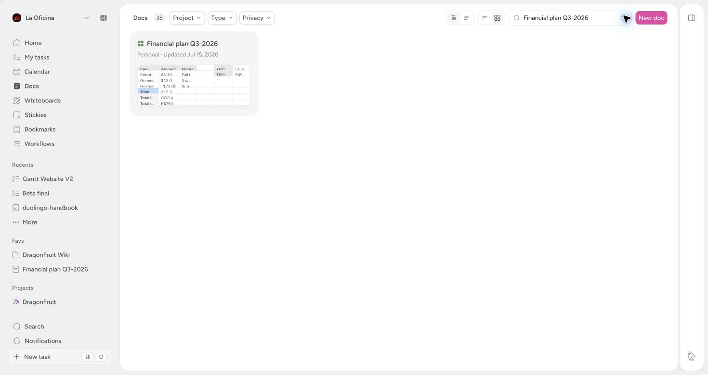

### Add view tasks to My tasks and column project in table view

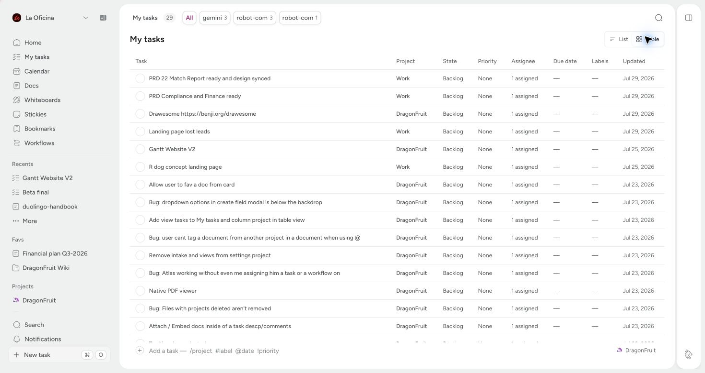

### Remove intake and views from settings project

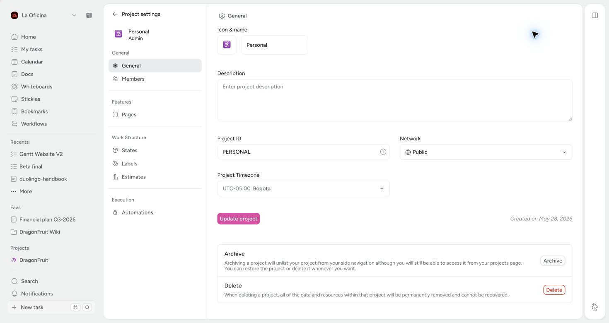

### Attach / Embed docs inside of a task descp/comments

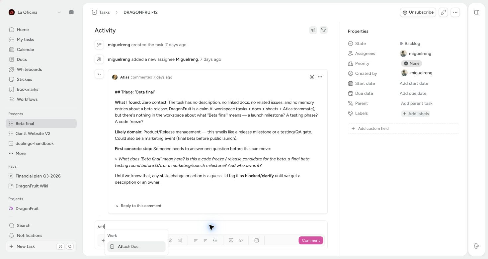

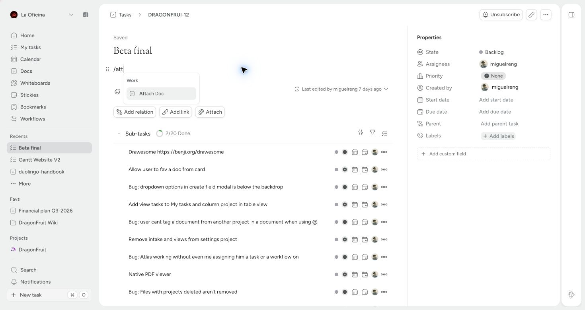

### dragonfruit.page added to publish settings

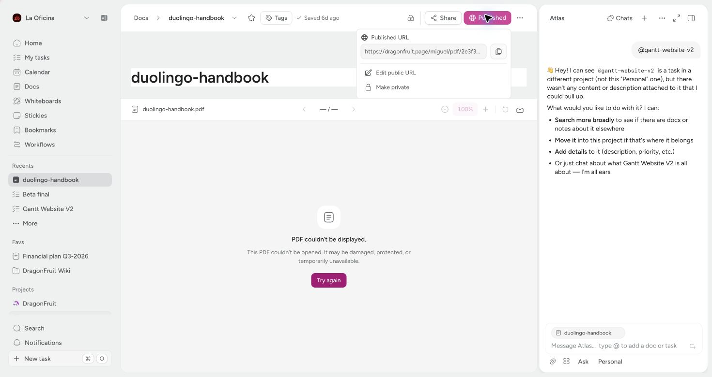

### Resize and snap sidebar atlas / Highlights when mentioning docs in Atlas sidebar

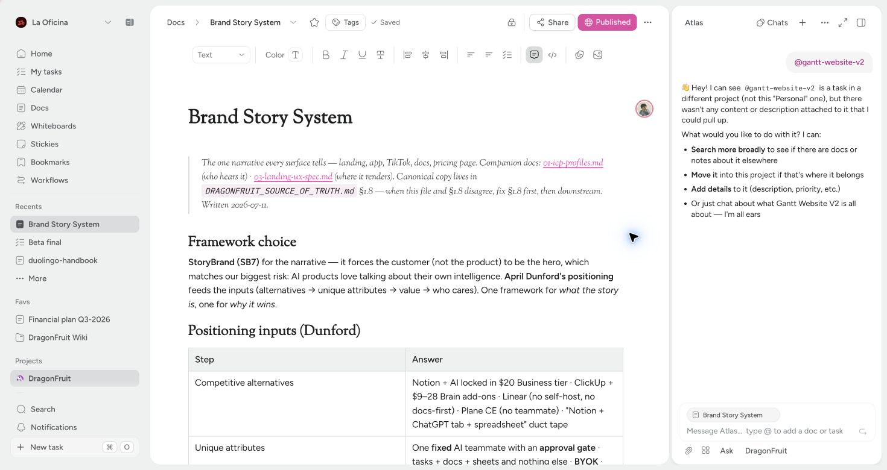

### Feature: Collaborators online in docs editor

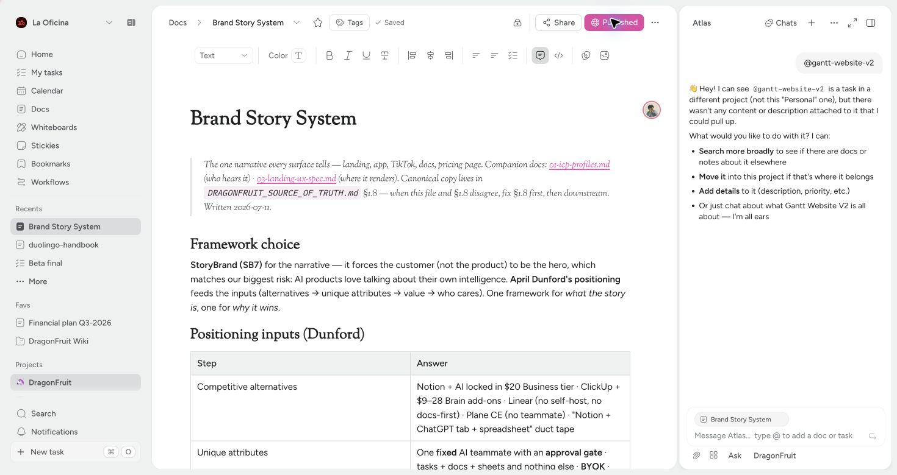

### Bug: Files with projects deleted aren't removed

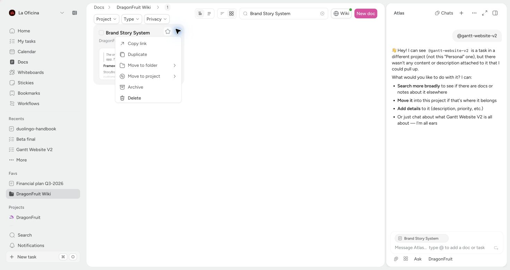

### Empty states with icons instead of illustrations

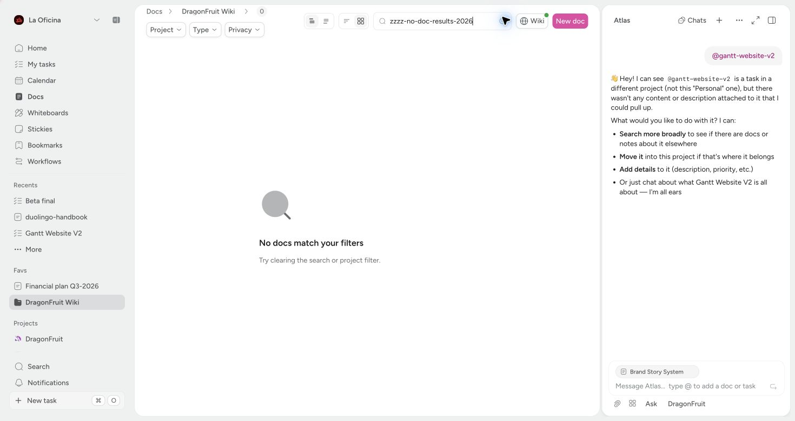

### Bug: dropdown options in create field modal is below the backdrop

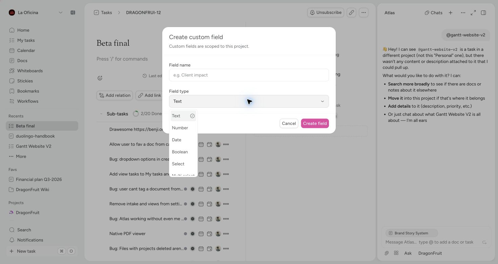

### Redesign event view modal

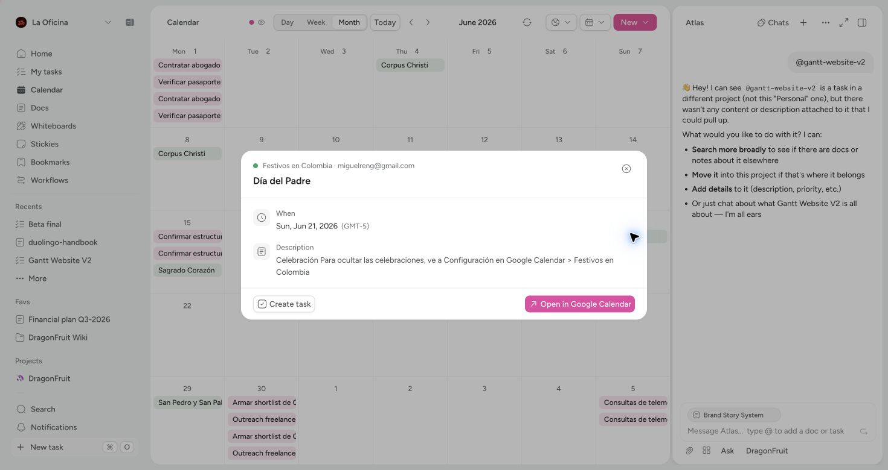

### Native PDF viewer — production blocker

The custom controls are deployed, but the screenshot records the missing API
rollout instead of presenting a false pass.

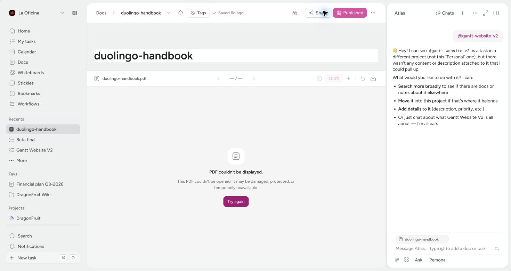
